<div align="center">

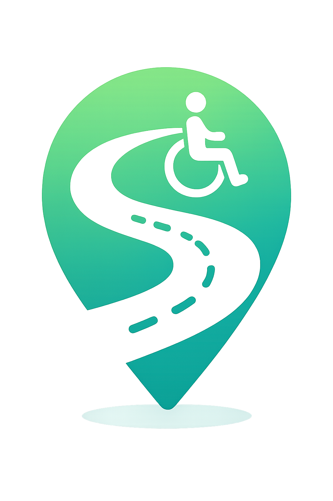

# SafeWay

**모두를 위한 안전한 길**

교통약자(장애인·노인·휠체어 이용자·임산부)를 위한 맞춤형 안전 경로 추천 웹 서비스

`2026.05.19 ~ 2026.06.26` · 팀 소보로빵 · SSAFY 1학기 관통 프로젝트

</div>

---

## 목차

1. [프로젝트 소개](#프로젝트-소개)
2. [팀원 소개](#팀원-소개)
3. [기술 스택](#기술-스택)
4. [주요 기능](#주요-기능)
5. [화면 구성](#화면-구성)
6. [프로젝트 폴더 구조](#프로젝트-폴더-구조)
7. [협업 방식](#협업-방식)
8. [프로젝트 산출물](#프로젝트-산출물)
9. [프로젝트 결과물](#프로젝트-결과물)
10. [회고](#회고)

---

## 프로젝트 소개

**SafeWay**는 교통약자가 목적지까지 이동할 때 필요한 **편의시설과 안전요소를 고려한 최적 경로**를 추천하고, 사용자 제보 기반 **위험구간 정보**를 제공하는 웹 서비스입니다.

기존 지도 서비스는 "가장 빠른 길"을 알려주지만, 휠체어 이용자에게 계단이 있는 길, 시각장애인에게 음향신호기가 없는 횡단보도는 "갈 수 없는 길"입니다. SafeWay는 사용자 유형별 보행 특성과 시설 데이터를 반영해 **안전 점수 기반의 맞춤 경로**를 제안합니다.

| 구분 | 이용 범위 |
| --- | --- |
| 비회원 | 지도 조회, 경로 추천, 시설 조회, 게시글 열람 |
| 회원 | 커뮤니티 CRUD, 프로필 관리, 팔로우, 좋아요, AI 챗봇, SOS |
| 관리자 | 게시글 관리, 사용자 관리, LLM 필터링 모니터링 |

- **프로젝트 기간**: 2026.05.19 ~ 2026.06.26
- **프로젝트 단계**: 13-PJT (AI 기반 추천 서비스)

---

## 팀원 소개

<table>
  <tr>
    <td align="center" width="50%">
      <a href="https://github.com/So-yeon-Jeon">
        
      </a>
      <h3>전소연</h3>
      
      <p>
        <a href="https://github.com/So-yeon-Jeon">
          
        </a>
      </p>
    </td>
    <td align="center" width="50%">
      <a href="https://github.com/BooGyya">
        
      </a>
      <h3>김보경</h3>
      
      <p>
        <a href="https://github.com/BooGyya">
          
        </a>
      </p>
    </td>
  </tr>
  <tr>
    <td valign="top">
      <ul>
        <li>Django REST API 전체 (회원·커뮤니티·경로·챗봇·관리자)</li>
        <li>외부 API 연동 (TMAP·카카오·공공데이터포털·OpenWeather·Solapi·GMS)</li>
        <li>경로 탐색 / 안전점수 알고리즘</li>
        <li>AI 챗봇 프롬프팅, LLM 콘텐츠 필터링</li>
        <li>공공데이터 수집·적재</li>
      </ul>
    </td>
    <td valign="top">
      <ul>
        <li>Vue 3 UI 전체 (지도·경로·커뮤니티·마이페이지·관리자)</li>
        <li>Kakao Maps SDK 연동</li>
        <li>Pinia 상태 관리</li>
        <li>접근성 설정, 반응형 디자인</li>
        <li>AI 챗봇 UI</li>
      </ul>
    </td>
  </tr>
</table>

---

## 기술 스택

### Frontend


### Backend


-000000?style=for-the-badge&logo=jsonwebtokens&logoColor=white)

### 외부 API & AI


-412991?style=for-the-badge&logo=openai&logoColor=white)

| 구분 | 기술 |
| --- | --- |
| 지도 | Kakao Maps API |
| 경로 탐색 | TMAP 보행자/대중교통 API, Kakao 자동차 경로 API |
| 실시간 신호 | 서울시 V2X API (교차로 2,779개 매핑) |
| AI | GMS API (gpt-5-nano) — 챗봇, 콘텐츠 필터링 |
| 인증 | JWT (SimpleJWT), 카카오 OAuth |
| 기타 | OpenWeather API, 서울 실시간 인구 API, Solapi (SOS 문자), 공공데이터포털 |

---

## 주요 기능

### 🗺️ 맞춤형 경로 추천 (핵심 기능)
- 4가지 경로 제공: **기본 추천 / 계단 없는 경로 / 큰길 우선 / 날씨 반영**
- 사용자 유형별(일반·노인·장애인·휠체어·임산부) 보행 속도 적용
- 음향신호기·잔여시간표시기 유무 기반 **안전 점수** 산출
- 횡단보도 **실시간 보행신호 잔여시간** 표시 (서울시 V2X 연동)
- 경로 주변 병원·약국·복지시설 정보 표시, 즐겨찾기·탐색 기록 저장

### 📍 지도
- 도보 / 대중교통 / 택시 이동 수단 선택 (택시 예상 요금 표시)
- 주변 시설 카테고리별 마커 (병원, 약국, 복지시설, 엘리베이터)
- 서울 주요 지역 실시간 인구 혼잡도, 관리자 확인 위험구간 마커

### 📢 불편신고함 (커뮤니티)
- 위험·장애물·파손·공사 등 카테고리별 신고 (위치 정보·사진 첨부)
- 좋아요, 댓글, 팔로우 / 관리자 신뢰도 부여 시 지도에 위험구간 반영
- **AI 기반 부적절 콘텐츠 자동 필터링**

### 🤖 안심도우미 (AI 챗봇)
- 자연어 기반 주변 시설·경로 안내, 현재 위치 기반 맞춤 답변
- "~에서 ~까지" 패턴 감지 시 경로 탐색 화면 자동 연동

### 👤 마이페이지
- 교통약자 유형·보행 속도·글꼴 크기(4단계) 설정
- **SOS 긴급 문자 발송** (보호자 번호 등록, 현재 위치 지도 링크 첨부)
- 즐겨찾기, 탐색 기록, 게시글, 팔로우 관리

### 🛡️ 관리자 페이지
- 게시글 관리 (신뢰도 부여, 위험구간 적용), 사용자 관리
- AI 콘텐츠 필터링 모니터링, 공지사항 관리

---

## 화면 구성

### 홈 (랜딩)

서비스 소개와 주요 기능 안내를 제공하는 진입 화면입니다.

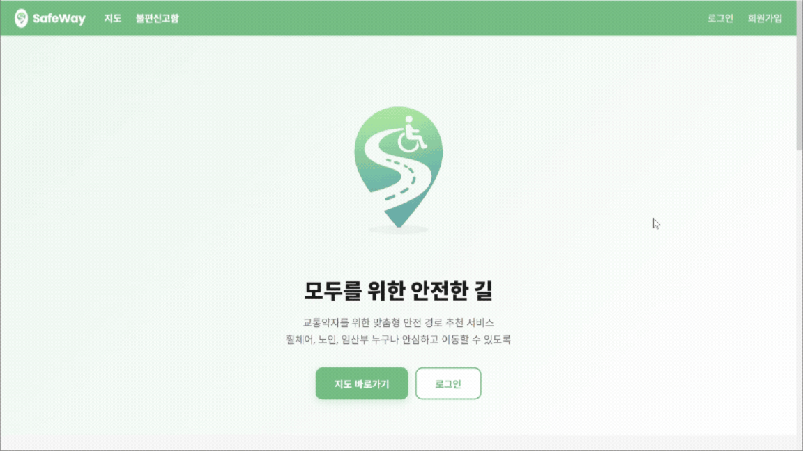

### 회원가입 / 로그인

이메일 회원가입과 카카오 소셜 로그인을 지원합니다.

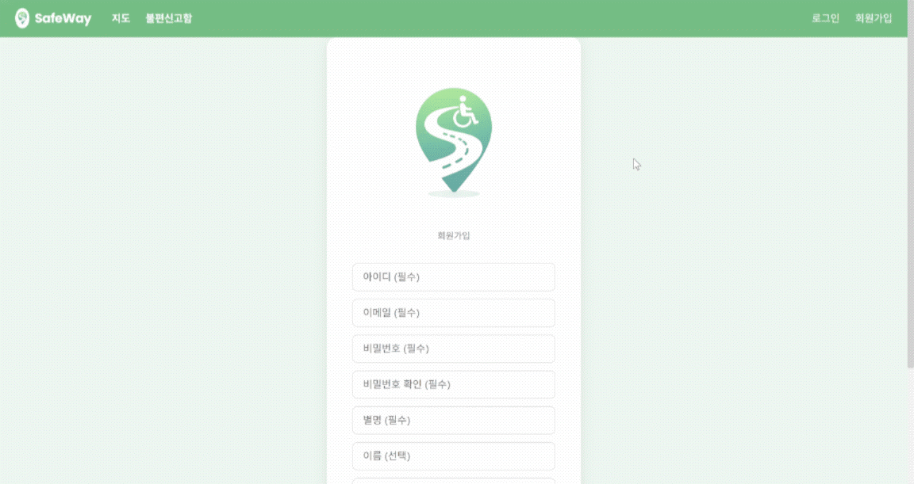

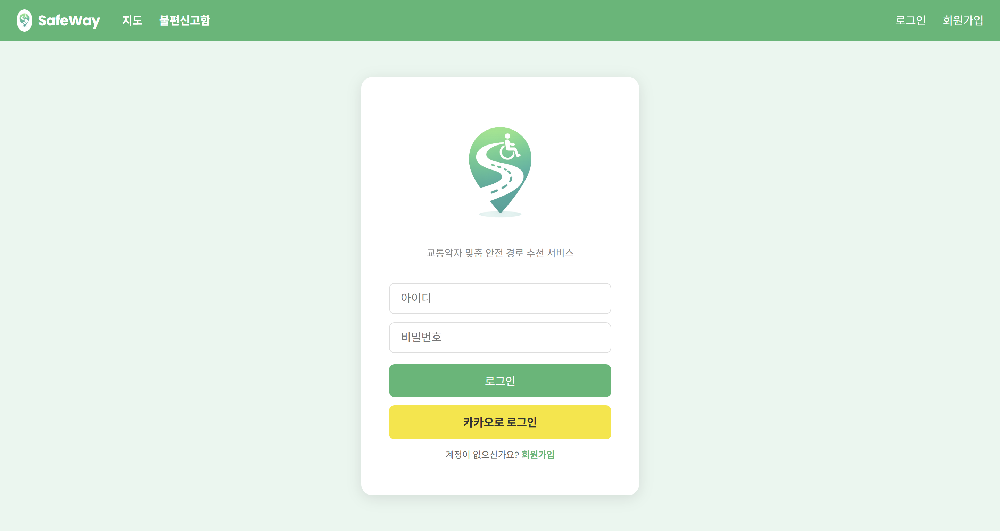

### 길찾기 — 도보 경로 추천 (메인 기능)

출발지/목적지 검색 후 교통약자 유형과 보행 속도를 반영한 안전 경로를 추천합니다. 경로 위 횡단보도에는 실시간 보행신호 잔여시간(서울)이 표시되고, 주변 병원·약국·복지시설·엘리베이터를 함께 확인할 수 있습니다.

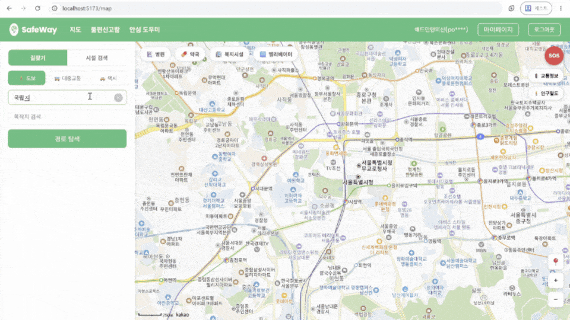

### 불편신고함 (커뮤니티)

보행 중 발견한 위험 구간을 카테고리(위험/장애물/파손/공사 등)와 위치 정보로 제보하고, 좋아요·댓글·팔로우로 소통합니다.

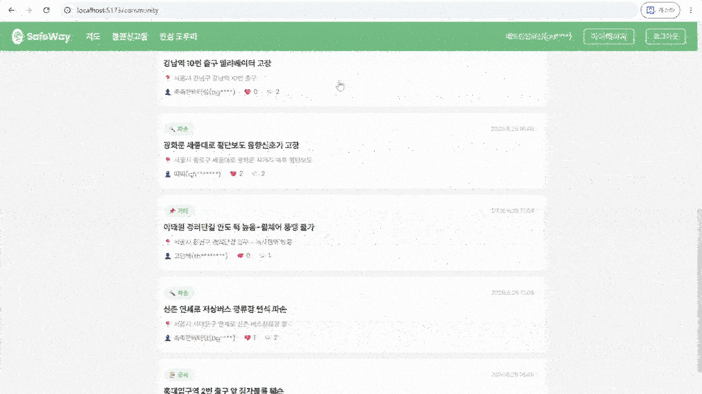

### 마이페이지

프로필·교통약자 유형·보행 속도·글씨 크기·SOS 번호를 설정하고, 최근 경로와 즐겨찾기·게시글·팔로우를 관리합니다.

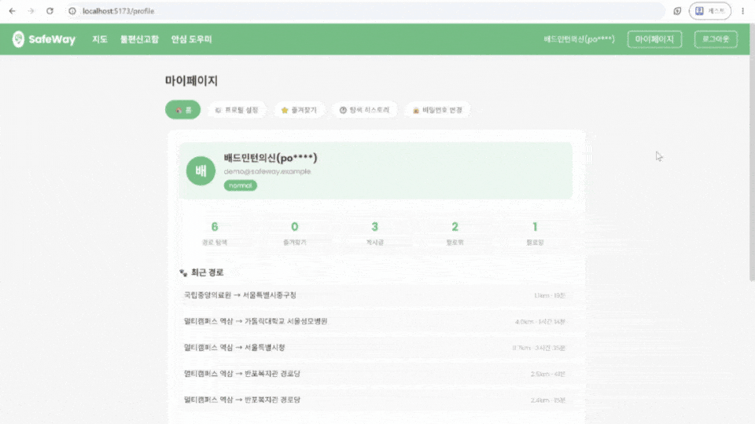

---

## 프로젝트 폴더 구조

```
safeway/
├── front/          # Vue 3 프론트엔드
│   └── src/
│       ├── views/          # 페이지 컴포넌트
│       ├── components/     # 공통 컴포넌트
│       ├── stores/         # Pinia 상태 관리
│       └── api/            # API 호출 모듈
├── back/           # Django 백엔드
│   ├── accounts/           # 회원 관리
│   ├── routes/             # 경로 탐색 · 안전점수 · V2X
│   ├── community/          # 커뮤니티 (불편신고함)
│   ├── chatbot/            # AI 챗봇 (안심도우미)
│   ├── infrastructure/     # 시설 정보 (신호등·엘리베이터 등)
│   ├── fixtures/           # 초기 데이터 (loaddata용, .json.gz)
│   ├── scripts/            # 공공데이터 수집 스크립트
│   └── config/             # 프로젝트 설정
└── docs/           # 설계 문서 · 트러블슈팅 · 스크린샷
```

<details>
<summary><b>실행 방법</b></summary>

```bash
# Backend
cd back
python -m venv venv && venv/Scripts/activate   # (Windows)
pip install -r requirements.txt
# back/.env 생성: SECRET_KEY, DEBUG, KAKAO_REST_API_KEY, KAKAO_JS_KEY,
#   KAKAO_REDIRECT_URI, FRONTEND_URL, TMAP_API_KEY, WEATHER_API_KEY,
#   SEOUL_TDATA_API_KEY, SEOUL_API_KEY, GMS_API_KEY,
#   COOLSMS_API_KEY, COOLSMS_API_SECRET, COOLSMS_SENDER
python manage.py migrate
python manage.py loaddata fixtures/trafficlight.json.gz fixtures/v2xintersection.json.gz fixtures/elevator.json.gz fixtures/supportcenter.json.gz fixtures/community.json.gz
python manage.py runserver
```

```bash
# Frontend
cd front
npm install
# front/.env 생성: VITE_KAKAO_JS_KEY
npm run dev
```

</details>

---

## 협업 방식

### 브랜치 전략

```
master              ← 최종 배포용 (직접 push 금지)
└── develop         ← 통합 개발 브랜치
    ├── back        ← 백엔드
    └── front       ← 프론트엔드
```

`back`/`front`에서 각자 작업 → `develop`으로 머지 → 안정화 시 `master` 머지.
팀원이 2명인 점을 고려해 기능 단위로 머지를 빠르게 반복하는 방식으로 운영했습니다.

### 커밋 컨벤션

| 타입 | 용도 | 예시 |
| --- | --- | --- |
| `feat` | 새로운 기능 추가 | `feat: V2X 신호 잔여시간 연동` |
| `fix` | 버그 수정 | `fix: 로그인 토큰 만료 오류 수정` |
| `docs` | 문서 수정 | `docs: README 업데이트` |
| `chore` | 설정 / 환경 / 패키지 | `chore: requirements.txt 업데이트` |

한국어 · 명령형 · 50자 이내 · 마침표 없이 작성

---

## 프로젝트 산출물

### 요구사항 정의서

기능 요구사항 9개 영역(FR-01 ~ FR-09) 45건과 비기능 요구사항(성능·보안·접근성·확장성)을 정의했습니다.

<details>
<summary><b>요구사항 요약 보기</b></summary>

| 영역 | 주요 요구사항 |
| --- | --- |
| FR-01 회원 관리 | 이메일/카카오 회원가입·로그인·로그아웃 |
| FR-02 지도 조회 | 지도 표시, 편의시설 마커, 시설 검색·상세 |
| FR-03 경로 탐색 | 맞춤 경로 추천, 편의시설 경유, 날씨 반영 재추천, 신호 잔여시간 반영, 혼잡도 반영 |
| FR-04 즐겨찾기·히스토리 | 경로 저장·조회·삭제, 탐색 기록 |
| FR-05 주변 시설 | 복지시설·병원·약국 조회 및 상세 |
| FR-06 AI 챗봇 | 자연어 질의, 시설 추천, 경로 안내, FAQ |
| FR-07 프로필 관리 | 교통약자 유형, 보행속도, 글씨 크기, SOS 번호, 비밀번호 변경 |
| FR-08 커뮤니티 | 위험구간 제보 CRUD, 댓글, 좋아요, 팔로우 |
| FR-09 관리자 | 게시글·사용자 관리, LLM 필터링 모니터링, 제보자 신뢰도, 공지사항 |

**비기능 요구사항**: 지도 로딩 3초·경로 추천 5초·API 응답 2초 이내 / JWT 인증·비밀번호 암호화 / 글자 크기 조절·키보드 네비게이션·음성 안내 / 신규 장애 유형·시설 유형 확장 가능 구조

</details>

### ERD

사용자·경로·시설·커뮤니티·외부 연동 데이터를 포함한 25개 테이블을 설계했습니다.

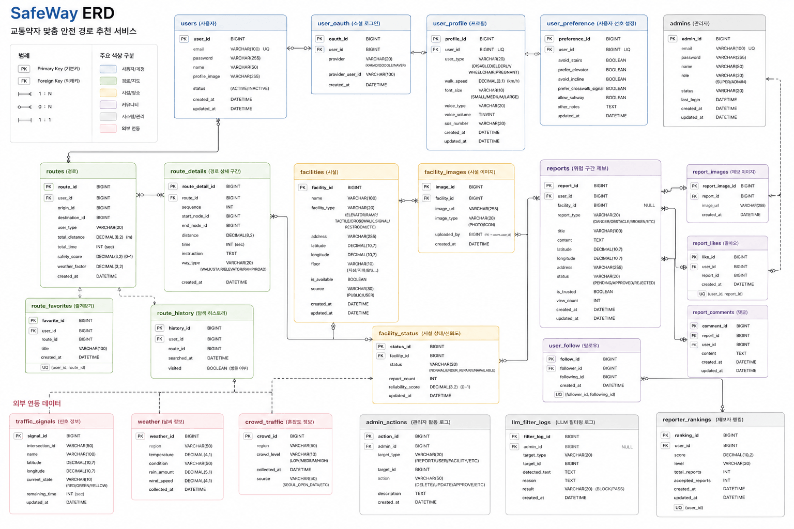

### 정보구조도 (IA)

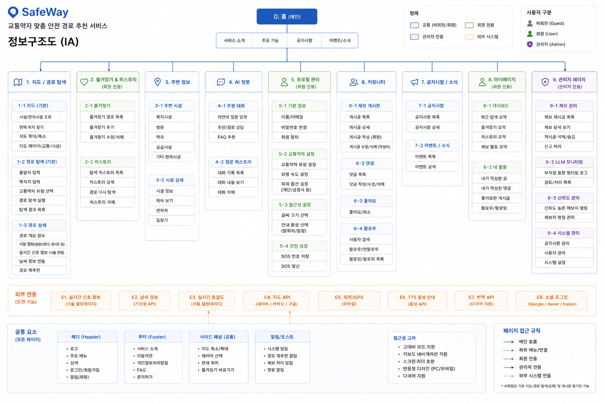

### 유스케이스 다이어그램

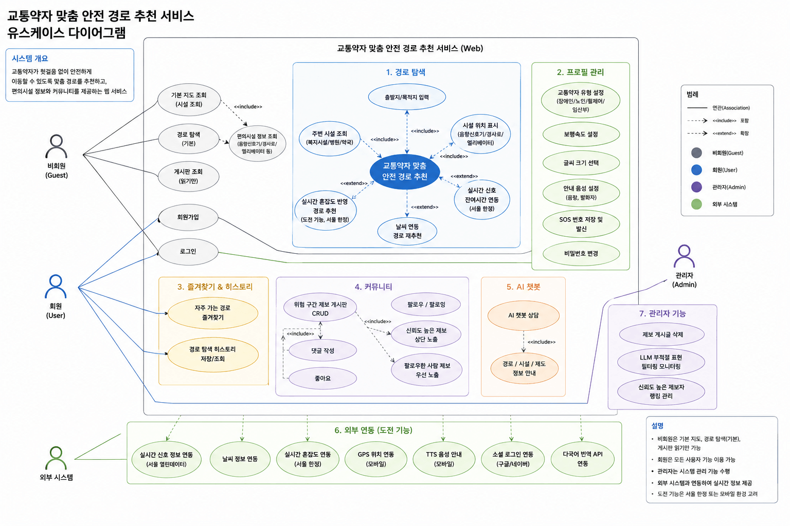

### 페이지 흐름도

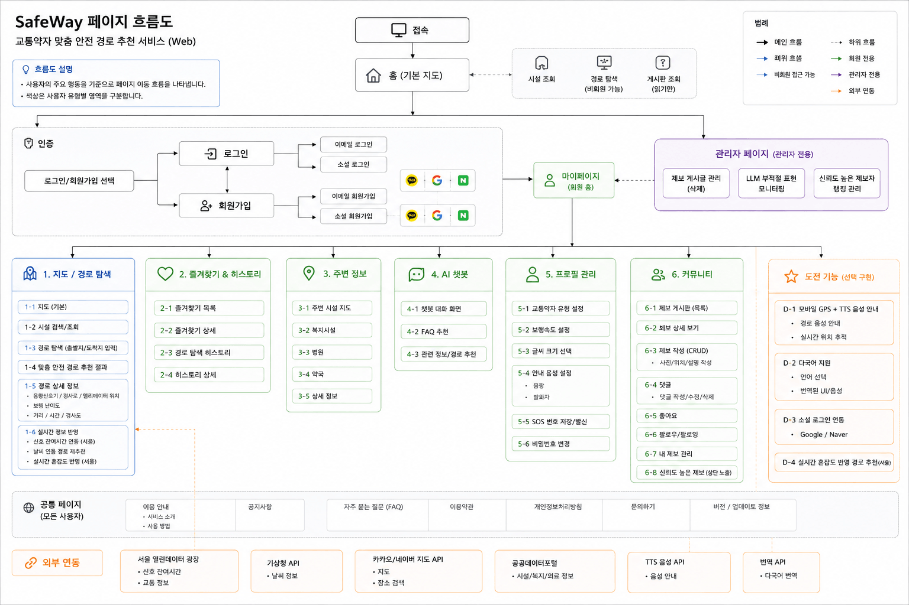

### 와이어프레임

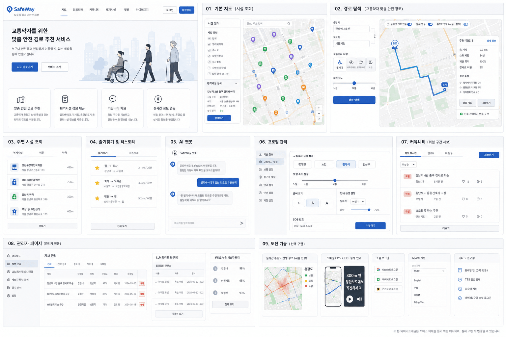

---

## 프로젝트 결과물

### 안전 점수 알고리즘

횡단보도·위험구간·이동거리를 기준으로 1.0에서 감점하는 방식으로 0~1 사이 점수를 계산합니다 (화면에는 ×100으로 표시).

```
crossing_penalty = 횡단보도마다 0.015(음향신호기 있음) / 0.035(없음), 최대 -0.35
distance_penalty = (이동거리 / 500m) × 0.01, 최대 -0.25
danger_penalty   = 관리자 승인 위험구간 1건당 -0.15, 최대 -0.45

score = clamp(1.0 - crossing_penalty - distance_penalty - danger_penalty, 0, 1)
```

장거리 경로에서 감점이 무한히 누적되어 전부 0점이 되는 것을 막기 위해 항목별 감점 상한을 두었습니다.

### 실시간 보행신호 잔여시간 (서울 V2X)

- V2X API는 위경도가 아닌 **교차로 ID(`itstId`) 기반**이라, 신호등 위경도 → 최근접 교차로 매핑 테이블(**2,779개 교차로**)을 직접 구축했습니다.
- 교차로 중심점 → 횡단보도 좌표의 **방위각을 계산해 8방향(북/북동/…/북서) 중 하나로 매핑**하고 해당 방향 값만 사용합니다. 다른 방향 값으로 대체하지 않아 차량신호 등 무관한 값이 섞이는 것을 방지했습니다.
- 값이 없으면 "대기 중(차량 신호)"으로 표시하고, `v2x_available` 플래그로 **"V2X 미설치"와 "현재 차량신호"를 구분**합니다.
- 0초 도달 시 자동 재조회, 대기 중 신호는 15초 간격 재조회로 **정확도와 1일 1,000회 API 한도 사이의 균형**을 맞췄습니다.

### 생성형 AI 활용

GMS API(`gpt-5-nano`)를 두 기능에 적용했습니다.

- **AI 챗봇 (안심도우미)**: 매 요청마다 사용자 유형·보행속도·위치(역지오코딩)·실시간 날씨를 시스템 프롬프트에 동적 주입해 개인화된 답변을 생성합니다. 지하철 호선·환승처럼 추측하면 위험한 실시간 정보는 추측하지 않고 지도로 안내하도록 프롬프트에 명시했습니다(환각 방지). 최근 대화 10개를 컨텍스트로 주입해 멀티턴 대화를 유지합니다.
- **LLM 콘텐츠 필터링**: 게시글 작성 시 제목+내용을 LLM에 전달해 욕설/혐오/비방/선정적 표현 여부를 **JSON 형식으로 강제 응답**받아 자동 차단합니다. `developer` 역할로 시스템 프롬프트를 분리하고 판단 이유까지 구조화해 응답받으며, 관리자가 최대 50개 게시글을 일괄 검사할 수 있습니다.

### 데이터 현황

| 데이터 | 규모 | 출처 |
| --- | --- | --- |
| 신호등(횡단보도) | 44,020건 (음향신호기 16,270 / 잔여시간표시기 11,818) | 공공데이터포털 |
| V2X 신호제어기 교차로 | 2,779건 | 서울 교통빅데이터플랫폼 |
| 지하철역 엘리베이터 | 서울 552 + 대전 37건 | 공공데이터포털 |
| 이동지원센터 | 176건 | 공공데이터포털 |
| 커뮤니티 샘플 | 테스트 계정·게시글·댓글 | 자체 테스트 데이터 |

`back/fixtures/`에 `loaddata`로 적재 가능한 `.json.gz` 형태로 포함되어 있습니다.

### 트러블슈팅

개발 과정의 문제 해결 기록 전체는 **[docs/TROUBLESHOOTING.md](docs/TROUBLESHOOTING.md)** 에 정리했습니다. 대표 사례 3가지:

<details>
<summary><b>① 실시간 보행신호가 339초로 표시되는 문제 (V2X 스펙 오해)</b></summary>

- 해당 방향이 보행 녹색이 아닐 때 API가 `36001`이라는 **"값 없음" 센티넬**을 반환하는데, 이를 실제 값처럼 표시하고 있었습니다.
- 문서상 센티초 단위처럼 보였으나 원본 응답을 직접 비교해 실제는 **데시초(1/10초)** 단위임을 확인했습니다.
- 센티넬 필터링 + 단위 변환 정정(`÷100` → `÷10`)으로 해결. 이후 "다른 방향 최솟값 fallback"이 남의 카운트다운을 빌려오는 문제(5→4→3→2→1 반복), 스냅샷 고정 문제, 0초 멈춤 문제까지 연쇄적으로 해결하며 실시간 신호 기능을 완성했습니다.

</details>

<details>
<summary><b>② 보행속도가 소요시간에 반영되지 않는 문제 (2중 원인)</b></summary>

- 1차: 백엔드가 요청 값을 무시하고 DB 기본값만 사용 → 요청 값 우선 적용으로 수정했지만 여전히 미반영.
- 2차: Network 탭으로 payload가 정상 전송됨을 확인 → **TMAP API가 `speed` 파라미터를 무시하고 자체 계산**하는 것이 진짜 원인.
- `거리 ÷ 사용자 속도`로 소요시간을 직접 재계산하도록 수정. **외부 API가 파라미터를 실제로 반영하는지 검증이 필요하다**는 교훈을 얻었습니다.

</details>

<details>
<summary><b>③ 카카오 로그인 KOE010 (11단계 가설 검증)</b></summary>

- 인가 코드는 정상 도착하는데 토큰 발급만 400 에러. 에러 응답 노출 → 키 설정 → `.env` 로드 → 따옴표 → 리다이렉트 URI → 인가 코드 만료 → 동의항목 → 앱 혼동 → payload 검증까지 **11단계 가설을 순차 검증**했습니다.
- 진짜 원인은 **클라이언트 시크릿이 활성화된 상태에서 토큰 요청에 미전송**된 것. 카카오 보안 알림 메일이 결정적 단서였습니다.
- 외부 API 에러는 응답 body를 그대로 노출시키는 것이 디버깅의 첫 단추임을 배웠습니다.

</details>

---

## 회고

- **공공데이터 정합성**: 출처마다 속성명·단위가 달라, 실제 서비스에 쓸 속성을 선별하고 표준화하는 작업이 필요했습니다. (승강기 API는 전체 조회 미지원으로 CSV 전환, 음향신호기 필드 파싱 오류 재수집 등)
- **외부 API의 숨겨진 단위/센티넬 값**: 문서만 믿지 않고 원본 응답을 직접 비교하는 습관이 생겼습니다.
- **API 호출 한도 관리**: 실시간성과 1일 호출 한도(1,000회) 사이의 트레이드오프를 직접 겪고 균형점을 찾았습니다.
- **프론트-백엔드 협업**: API 응답 구조 변경 시 필드명 동기화 문제를 반복 겪으며, 응답 규격을 문서로 공유하는 프로세스를 정착시켰습니다.
- **향후 개선 방향**: AWS 등 클라우드 배포, 모바일 GPS + TTS 음성 안내, 다국어 지원.
